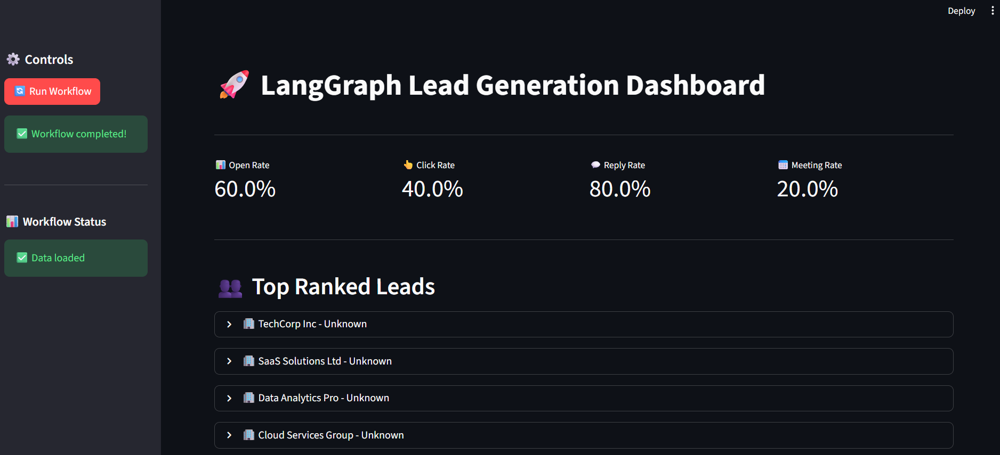
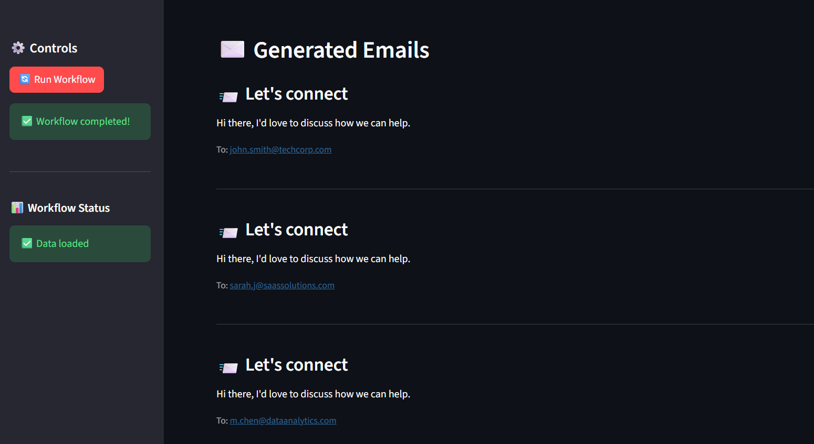
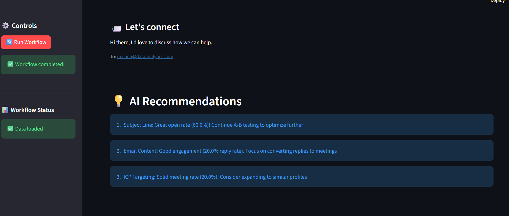

# 🚀 LangGraph Autonomous Lead Generation System

An **AI-powered end-to-end B2B lead generation system** built with **LangGraph** that autonomously discovers, enriches, scores, and contacts prospects — all while learning and improving over time.

---

## 📋 Overview

This system automates the entire outbound lead generation workflow using **7 specialized AI agents** working in sequence — orchestrated by **LangGraph** and fully configurable via a single JSON file.

### 🔑 Key Features
| Feature | Description |
|----------|-------------|

| 🤖 Multi-Agent System | 7 specialized agents work in sequence |

| ⚙️ JSON-Driven Workflow | Entire pipeline defined in `workflow.json` |

| 🔄 Self-Improving | Feedback loop analyzes and optimizes performance |

| 🔌 Multi-API Integration | Clay, Apollo, Clearbit, OpenAI, SendGrid |

| 📊 Performance Tracking | Tracks opens, replies, conversions |

| 🧠 LLM-Powered | Uses GPT-4 for personalized outreach |

| 🧱 Modular Design | Agents are independently testable and replaceable |

---

## 🏗️ Architecture

workflow.json → LangGraph Builder → Agent Pipeline → Results
↓
Feedback Loop


### 🧩 Agent Pipeline

| Agent | Function |
|--------|-----------|
| `ProspectSearchAgent` | Discovers leads via Clay & Apollo APIs |
| `DataEnrichmentAgent` | Adds firmographic & technographic data via Clearbit |
| `ScoringAgent` | Ranks leads based on ICP fit |
| `OutreachContentAgent` | Generates personalized emails using GPT-4 |
| `OutreachExecutorAgent` | Sends outreach emails via SendGrid or Apollo |
| `ResponseTrackerAgent` | Tracks engagement metrics |
| `FeedbackTrainerAgent` | Suggests workflow improvements |

---

## 📂 Project Structure

langgraph-lead-gen/
├── agents/
│ ├── base_agent.py
│ ├── prospect_search.py
│ ├── enrichment.py
│ ├── scoring.py
│ ├── outreach_content.py
│ ├── outreach_executor.py
│ ├── response_tracker.py
│ └── feedback_trainer.py
├── config/
│ └── workflow.json
├── utils/
│ ├── logger.py
│ └── api_clients.py
├── langgraph_builder.py
├── main.py
├── requirements.txt
├── .env.example
└── README.md


---

## ⚙️ Setup Instructions

### 🧾 Prerequisites
- Python **3.11+**
- API Keys for:
  - OpenAI (Required)
  - Apollo (Required)
  - Clay / Clearbit / SendGrid (Optional)

---

### 🛠️ Installation

```bash
# Clone or create project directory
git clone https://github.com/Hardik-Kaushik/langgraph-lead-gen.git
cd langgraph-lead-gen

# Create & activate virtual environment
python -m venv venv
venv\Scripts\activate  # Windows
# source venv/bin/activate  # Mac/Linux

# Install dependencies
pip install -r requirements.txt


🔑 Configure Environment :

# Copy example file
cp .env.example .env

# Open .env and add your keys
notepad .env   # Windows
nano .env      # Linux/Mac


.env Format:

# OpenAI (Required)
OPENAI_API_KEY=sk-your-key

# Apollo (Required)
APOLLO_API_KEY=your_apollo_key

# Optional APIs
CLAY_API_KEY=your_clay_key
CLEARBIT_KEY=your_clearbit_key
SENDGRID_API_KEY=your_sendgrid_key

# Feedback Logging
GOOGLE_SHEETS_CREDENTIALS_PATH=./credentials.json
GOOGLE_SHEET_ID=your_sheet_id


🚀 Running the System

python main.py

🧭 Expected Output
============================================================
LangGraph Autonomous Lead Generation Workflow
============================================================
[prospect_search] Found 10 leads from Apollo
[enrichment] Enriched leads with Clearbit data
[scoring] Ranked leads by ICP fit
[outreach_content] Generated personalized emails
[outreach_executor] Sent emails successfully
[response_tracker] Logged engagement metrics
[feedback_trainer] Suggested workflow improvements
============================================================
Workflow completed successfully!
============================================================

🧱 Streamlit Dashboard (Visualization)

The project includes an interactive Streamlit dashboard for visualizing:

Lead discovery results

Email generation samples

Scoring distribution

Outreach performance metrics


▶️ Run Dashboard

streamlit run dashboard.py








| Section               | Description                      |
| --------------------- | -------------------------------- |
| 🔍 Lead Discovery     | View raw leads fetched from APIs |
| 📈 Scoring Metrics    | Visualize ICP-based ranking      |
| ✉️ Outreach Preview   | See generated email templates    |
| 📊 Engagement Tracker | Track replies, opens, clicks     |
| 🧠 Feedback Insights  | Suggestions from FeedbackTrainer |


🧩 Configuration
🎯 ICP Criteria
{
  "icp": {
    "industry": "SaaS",
    "location": "USA",
    "employee_count": { "min": 100, "max": 1000 },
    "revenue": { "min": 20000000, "max": 200000000 }
  }
}

⚖️ Scoring Weights
{
  "config": {
    "scoring": {
      "revenue_weight": 0.3,
      "employee_weight": 0.2,
      "technology_weight": 0.3,
      "signal_weight": 0.2
    }
  }
}

🗣️ Messaging Tone
{
  "inputs": {
    "persona": "SDR",
    "tone": "friendly"
  }
}


🧪 Testing

Test Individual Agents

from agents import ProspectSearchAgent
agent = ProspectSearchAgent(agent_id="test", instructions="Test search", tools=[])
result = agent.execute({"icp": {"industry": "SaaS", "location": "USA"}})
print(result)

Test Full Workflow

python main.py


Logs are saved in:
workflow_<timestamp>.log


🔧 Extending the System
➕ Add a Custom Agent
class MyCustomAgent(BaseAgent):
    def execute(self, inputs):
        result = {"custom_data": "value"}
        self.log_execution(inputs, result)
        return result


Then register it in:

agents/__init__.py

langgraph_builder.py

Add step in workflow.json


| Component       | Technology            | Purpose                      |
| --------------- | --------------------- | ---------------------------- |
| Agent Framework | LangGraph + LangChain | Workflow orchestration       |
| LLM             | OpenAI GPT-4o-mini    | Email generation & reasoning |
| Lead Sources    | Apollo, Clay          | Prospect discovery           |
| Enrichment      | Clearbit              | Firmographic data            |
| Email Delivery  | SendGrid / Apollo     | Outreach execution           |
| Storage         | ChromaDB              | Vector memory                |
| Feedback        | Google Sheets         | Performance tracking         |
| Dashboard       | Streamlit             | Visualization                |

Output Summary

| Output Type   | Description                           |
| ------------- | ------------------------------------- |
| Leads         | Company name, email, LinkedIn, source |
| Enriched Data | Job title, tech stack, size, industry |
| Scores        | 0–1 ICP fit score                     |
| Emails        | Personalized subjects & bodies        |
| Metrics       | Open, click, and reply rates          |
| Feedback      | Recommendations for next run          |


📚 Resources

LangGraph Docs

LangChain Python Docs

Apollo API Docs

OpenAI API Docs

🤝 Contributing

Fork the repository

Create a new branch

Make your improvements

Submit a PR

📄 License

MIT License — Free to use, modify, and distribute.

🎯 Project Goals

JSON-driven dynamic workflows

Modular agent architecture

Seamless API integrations

Self-learning feedback loop

Streamlit visualization