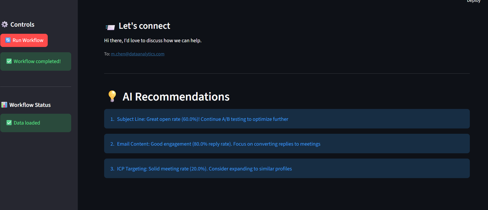

🚀 LangGraph Autonomous Lead Generation System
An AI-powered end-to-end outbound lead generation system built with LangGraph that autonomously discovers, enriches, scores, and contacts B2B prospects.

📋 Overview
This system automates the entire B2B lead generation workflow using 7 specialized AI agents that work together in a pipeline orchestrated by LangGraph. The workflow is dynamically built from a single JSON configuration file, making it highly customizable and maintainable.

Key Features
🤖 7 Specialized AI Agents working in sequence
📋 JSON-Driven Workflow - entire pipeline defined in one config file
🔄 Self-Improving - feedback loop analyzes performance and suggests optimizations
🔌 Multi-API Integration - Clay, Apollo, Clearbit, OpenAI, SendGrid
📊 Performance Tracking - monitors open rates, replies, and conversions
🧠 LLM-Powered - uses GPT-4 for content generation and analysis
🏗️ Architecture
workflow.json → LangGraph Builder → Agent Pipeline → Results
                                          ↓
                                    Feedback Loop
Agent Pipeline:
ProspectSearchAgent - Discovers leads matching ICP via Clay & Apollo APIs
DataEnrichmentAgent - Enriches with firmographic/technographic data via Clearbit
ScoringAgent - Scores and ranks leads based on ICP fit criteria
OutreachContentAgent - Generates personalized emails using GPT-4
OutreachExecutorAgent - Sends emails via Apollo/SendGrid APIs
ResponseTrackerAgent - Monitors engagement metrics (opens, clicks, replies)
FeedbackTrainerAgent - Analyzes performance and suggests workflow improvements
📂 Project Structure
langgraph-lead-gen/
├── agents/                      # All agent implementations
│   ├── __init__.py
│   ├── base_agent.py           # Base class for all agents
│   ├── prospect_search.py      # Lead discovery agent
│   ├── enrichment.py           # Data enrichment agent
│   ├── scoring.py              # Lead scoring agent
│   ├── outreach_content.py     # Email generation agent
│   ├── outreach_executor.py    # Email sending agent
│   ├── response_tracker.py     # Response monitoring agent
│   └── feedback_trainer.py     # Performance analysis agent
├── config/
│   └── workflow.json           # Workflow configuration
├── utils/
│   ├── __init__.py
│   ├── logger.py               # Logging configuration
│   └── api_clients.py          # API client utilities
├── langgraph_builder.py        # Core LangGraph builder
├── main.py                     # Entry point
├── requirements.txt            # Python dependencies
├── .env.example                # Environment variables template
├── .env                        # Your API keys (not in git)
├── .gitignore                  # Git ignore rules
└── README.md                   # This file
🛠️ Setup Instructions
Prerequisites
Python 3.11 or higher
API keys for: OpenAI, Apollo, Clay (optional), Clearbit (optional), SendGrid (optional)
Installation
Clone or create the project directory
bash
mkdir langgraph-lead-gen
cd langgraph-lead-gen
Create and activate virtual environment
bash
# Create virtual environment
python -m venv venv

# Activate it
# On Windows:
venv\Scripts\activate
# On Mac/Linux:
source venv/bin/activate
Install dependencies
bash
pip install -r requirements.txt
Configure environment variables
bash
# Copy the example file
cp .env.example .env

# Edit .env and add your API keys
# Use any text editor or:
nano .env  # Linux/Mac
notepad .env  # Windows
Verify installation
bash
# Check Python version
python --version  # Should be 3.11+

# Verify imports work
python -c "from agents import ProspectSearchAgent; print('✅ Setup complete!')"
🔑 API Keys Setup
Required APIs
1. OpenAI API (Required)
Sign up: https://platform.openai.com/signup
Get key: https://platform.openai.com/api-keys
Add to .env: OPENAI_API_KEY=sk-your-key-here
Cost: ~$0.01-0.10 per workflow run with GPT-4o-mini
2. Apollo API (Required)
Sign up: https://app.apollo.io/#/sign-up
Get key: Settings → Integrations → API
Add to .env: APOLLO_API_KEY=your-key-here
Free tier: 50 credits/month
Optional APIs
3. Clay API (Optional)
Sign up: https://clay.com/
Note: May require contacting support for API access
Alternative: Use Apollo only (works fine without Clay)
4. Clearbit API (Optional)
Sign up: https://clearbit.com/
Free trial: Available for testing
Alternative: System uses mock data if key not provided
5. SendGrid API (Optional)
Sign up: https://signup.sendgrid.com/
Get key: Settings → API Keys
Alternative: System simulates email sending without key
.env File Format
env
# OpenAI (Required)
OPENAI_API_KEY=sk-proj-xxxxxxxxxxxxx

# Apollo (Required)
APOLLO_API_KEY=your_apollo_key_here

# Optional APIs
CLAY_API_KEY=your_clay_key_here
CLEARBIT_KEY=your_clearbit_key_here
SENDGRID_API_KEY=your_sendgrid_key_here

# Google Sheets (for feedback logging)
GOOGLE_SHEETS_CREDENTIALS_PATH=./credentials.json
GOOGLE_SHEET_ID=your_sheet_id_here
🚀 Running the System
Execute Full Workflow
bash
python main.py
Expected Output
============================================================
LangGraph Autonomous Lead Generation Workflow
============================================================
2025-10-18 10:00:00 - Main - INFO - Loading workflow config
2025-10-18 10:00:01 - LangGraphBuilder - INFO - Building LangGraph workflow...
2025-10-18 10:00:01 - LangGraphBuilder - INFO - Executing node: prospect_search
2025-10-18 10:00:03 - Agent.prospect_search - INFO - Found 10 leads from Apollo

[prospect_search]
{
  "leads": [
    {
      "company": "Acme Corp",
      "contact_name": "Jane Smith",
      "email": "jane@acme.com",
      "linkedin": "linkedin.com/in/janesmith",
      "signal": "apollo_match"
    },
    ...
  ]
}

[enrichment]
{
  "enriched_leads": [
    {
      "company": "Acme Corp",
      "contact": "Jane Smith",
      "role": "VP of Sales",
      "technologies": ["Salesforce", "HubSpot", "Slack"]
    }
  ]
}

[scoring]
{
  "ranked_leads": [
    {"company": "Acme Corp", "score": 0.87, ...}
  ]
}

[outreach_content]
{
  "messages": [
    {
      "lead": "Jane Smith",
      "email": "jane@acme.com",
      "subject": "Transforming Sales Analytics at Acme",
      "email_body": "Hi Jane, I noticed Acme recently..."
    }
  ]
}

============================================================
Workflow completed successfully!
============================================================
📝 Configuration
Customizing the Workflow
Edit config/workflow.json to customize:

ICP (Ideal Customer Profile) Criteria
json
{
  "icp": {
    "industry": "SaaS",
    "location": "USA",
    "employee_count": { "min": 100, "max": 1000 },
    "revenue": { "min": 20000000, "max": 200000000 }
  }
}
Scoring Weights
json
{
  "config": {
    "scoring": {
      "revenue_weight": 0.3,
      "employee_weight": 0.2,
      "technology_weight": 0.3,
      "signal_weight": 0.2
    }
  }
}
Messaging Tone
json
{
  "inputs": {
    "persona": "SDR",
    "tone": "friendly"  // Options: friendly, professional, casual
  }
}
🧪 Testing
Test Individual Agents
Create a test file test_agents.py:

python
from dotenv import load_dotenv
from agents import ProspectSearchAgent

load_dotenv()

# Test ProspectSearchAgent
agent = ProspectSearchAgent(
    agent_id="test",
    instructions="Test search",
    tools=[]
)

result = agent.execute({
    "icp": {
        "industry": "SaaS",
        "location": "USA"
    }
})

print(f"Found {len(result.get('leads', []))} leads")
Run the test:

bash
python test_agents.py
Test Full Workflow
bash
python main.py
Check the logs in workflow_TIMESTAMP.log for detailed execution info.

🔧 Extending the System
Adding a New Agent
Create agent file in agents/ directory:
python
from .base_agent import BaseAgent
from typing import Dict, Any

class MyCustomAgent(BaseAgent):
    def execute(self, inputs: Dict[str, Any]) -> Dict[str, Any]:
        # Your custom logic here
        result = {"custom_data": "value"}
        self.log_execution(inputs, result)
        return result
Register in agents/__init__.py:
python
from .my_custom_agent import MyCustomAgent

__all__ = [
    # ... existing agents
    "MyCustomAgent"
]
Add to workflow.json:
json
{
  "id": "custom_step",
  "agent": "MyCustomAgent",
  "inputs": {"data": "{{previous_step.output.field}}"},
  "instructions": "Process custom data",
  "tools": [],
  "output_schema": {"custom_data": "string"}
}
Update langgraph_builder.py agent_map:
python
self.agent_map = {
    # ... existing agents
    "MyCustomAgent": MyCustomAgent
}
Adding New API Integration
Add client to utils/api_clients.py:
python
class CustomAPIClient(APIClient):
    def __init__(self):
        super().__init__(
            base_url="https://api.custom.com",
            api_key=os.getenv("CUSTOM_API_KEY")
        )
    
    def custom_method(self, params):
        return self.post("endpoint", params)
Reference in agent's tools config in workflow.json
Use in agent's execute() method
🐛 Troubleshooting
Common Issues
"No module named 'langgraph'"
bash
# Solution: Reinstall dependencies
pip install -r requirements.txt
"API key not found"
bash
# Solution: Check .env file
cat .env  # Should show your keys
# Make sure .env is in project root directory
"Invalid JSON in workflow.json"
bash
# Solution: Validate JSON syntax
python -c "import json; json.load(open('config/workflow.json'))"
# Fix any syntax errors shown (trailing commas, quotes, etc.)
"Import error: agents module"
bash
# Solution: Ensure __init__.py exists in agents/ folder
ls agents/__init__.py
# Run from project root, not from subdirectory
Viewing Logs
Detailed logs are saved to workflow_TIMESTAMP.log:

bash
# View latest log
tail -f workflow_*.log  # Mac/Linux
type workflow_*.log     # Windows

# Or open in VS Code
code workflow_*.log
📊 Output Format
The system generates structured JSON output for each agent:

Lead Lists: Company name, contact info, signals
Enriched Data: Job titles, technologies, company details
Scores: 0-1 ranking based on ICP fit
Email Content: Personalized subject lines and body text
Campaign Metrics: Open rates, click rates, reply rates
Recommendations: Suggested improvements for next campaign

🚀 Deployment Options
Local Development (Current)
bash
python main.py
Docker (Optional)
dockerfile
FROM python:3.11-slim
WORKDIR /app
COPY requirements.txt .
RUN pip install -r requirements.txt
COPY . .
CMD ["python", "main.py"]
Build and run:

bash
docker build -t langgraph-lead-gen .
docker run --env-file .env langgraph-lead-gen
Cloud Deployment (Optional)
AWS Lambda: Use with 15-minute timeout
Google Cloud Run: Serverless deployment
Heroku: With scheduler add-on
📚 Tech Stack
Component	Technology	Purpose
Agent Framework	LangGraph + LangChain	Workflow orchestration
LLM	OpenAI GPT-4o-mini	Content generation & reasoning
Data Sources	Clay API, Apollo API	Lead discovery
Enrichment	Clearbit, PeopleDataLabs	Firmographic data
Email Delivery	SendGrid, Apollo API	Outreach execution
Vector Storage	Chroma DB	Memory persistence
Feedback Loop	Google Sheets API	Performance tracking
Runtime	Python 3.11+	Core execution
📖 Additional Resources
LangGraph Docs: https://langchain-ai.github.io/langgraph/
LangChain Docs: https://python.langchain.com/
Apollo API Docs: https://apolloio.github.io/apollo-api-docs/
OpenAI API Docs: https://platform.openai.com/docs
🤝 Contributing
This is a task submission project, but you can extend it:

Fork the repository
Create a feature branch
Make your changes
Test thoroughly
Submit a pull request
📄 License
MIT License - Feel free to use and modify for your needs.

🎯 Project Goals
This system was built to demonstrate:

Dynamic workflow construction from JSON configuration
Modular, testable AI agent architecture
Multi-API integration and orchestration
Self-improving feedback loops
Production-ready code structure
📧 Support
For questions about this implementation:

Check the troubleshooting section above
Review the agent logs for detailed error messages
Test components individually to isolate issues
✅ Pre-Submission Checklist
 All agents implemented and tested
 Workflow executes end-to-end
 Documentation complete
 API keys configured
 Code follows best practices
 Logs generated successfully
Built with ❤️ using LangGraph, LangChain, and AI-assisted development

Last Updated: October 2025

